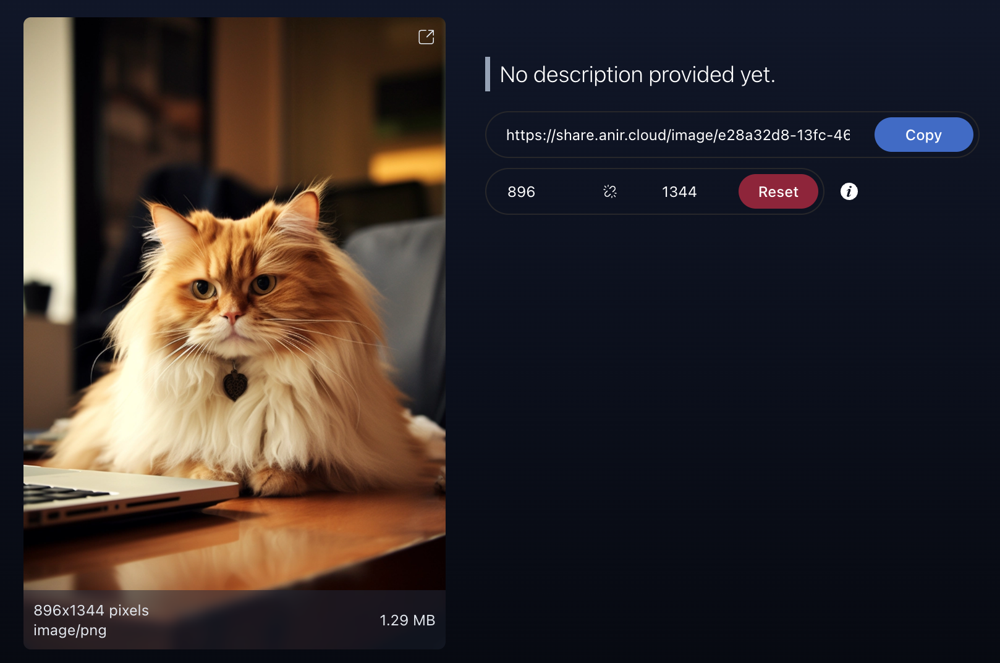

# Slink: Image Sharing Platform


[](LICENSE)


This is a self-hosted image sharing platform built with [Symfony](https://symfony.com/) and [SvelteKit](https://kit.svelte.dev/).

**Note:** This project is still under development. Before using it in production, make sure to secure your application properly.

## Installation
To install the application, you need to have [Docker](https://docs.docker.com/get-docker/) installed on your system.

Just run the following command to start the application:
```bash
docker run -d \
    --name slink \
    -p 3000:3000 \
    -v ./slink/var/data:/app/var/data \
    -v ./slink/images:/app/slink/images \
    anirdev/slink:latest
```

### Docker Compose

You can also use [Docker Compose](https://docs.docker.com/compose/) to start the application.
```yaml
slink:
    image: anirdev/slink:latest
    container_name: slink
    volumes:
      # Persist the database
      - ./slink/var/data:/app/var/data
      # Persist the uploaded images
      - ./slink/images:/app/slink/images
    ports:
      # Expose the application on port 3000
      - "3000:3000"
```

## Configuration
The application can be configured using environment variables. The following environment variables are available:

| Variable | Description                                                      | Default Value |
| -------- |------------------------------------------------------------------|---------------|
| `STORAGE_PROVIDER` | Storage provider to use. Available options are `local` and `smb` | `local` |
| `SMB_HOST` | SMB host to connect to. Required if `STORAGE_PROVIDER` is set to `smb` | `null` |
| `SMB_USERNAME` | SMB username to use. Required if `STORAGE_PROVIDER` is set to `smb` | `null` |
| `SMB_PASSWORD` | SMB password to use. Required if `STORAGE_PROVIDER` is set to `smb` | `null` |
| `SMB_SHARE` | SMB share to use. Required if `STORAGE_PROVIDER` is set to `smb` | `null` |

## Security
As of now, the application doesn't have any security measures in place. So, make sure to secure your application properly before using it in production.

Some of the routes has to be protected from unauthorized access.
Make sure that `/` and `/api/upload` are not accessible from outside your network.

**Note:** In the upcoming releases, authentication will be added to the application. Which will address some of the security concerns.

## Contributing
Pull requests are welcome. For major changes, please open an issue first to discuss what you would like to change.

## License

This project is licensed under the MIT License. See the [LICENSE](LICENSE) file for details.
