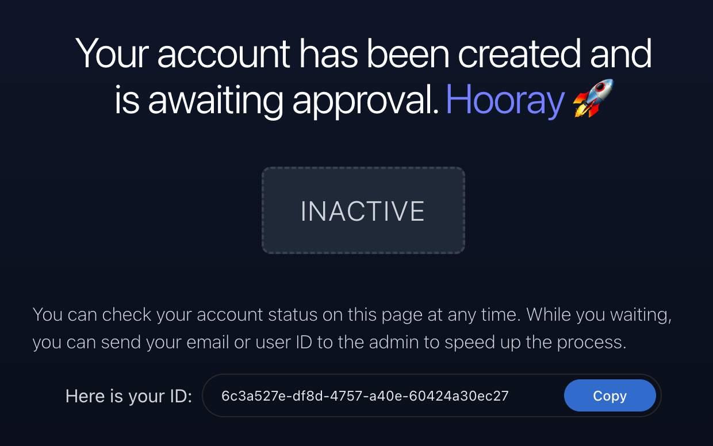

# Slink: Image Sharing Platform


[](LICENSE)


**Slink** is a self-hosted image sharing platform built with [Symfony](https://symfony.com/) and [SvelteKit](https://kit.svelte.dev/)️.

Solves the problem of sharing images with friends, family, and colleagues without relying on third-party services. It also offers a platform for artists to share their work with the community. Additionally, developers may find it useful for self-hosting screenshots of personal projects, which can then be used on GitHub, portfolios, blogs, etc.

## Features
- **Authentication**: Users can sign up and log in to the platform.
- **User Approval**: Require user approval before they can upload images.
- **Image Upload**: _SVG_, _PNG_, _JPG_, _WEBP_, _BMP_, _ICO_ or _GIF_ images can be uploaded.
- **Share Links**: Users can share links to their uploaded images and customize the image size.
- **Upload History**: Provides an overview of all images uploaded by the user.
- **Storage Providers**: Support for _local_ and _SMB_ storage providers.
- **Explore Images**: Features a listing page of public images uploaded by other users.
- **Dark Mode**: Includes support for both _Dark_ and _Light_ modes in the application.
- **Dashboard**: Enhanced statistics and analytics for admin users.

### Upcoming Features
> [!IMPORTANT]
> 
> Those might be changed or removed in the future according to the community feedback and priorities.

- **CDN Support**: Support for _CDN_ _providers_ to reduce the load on the self-hosted server.
- **Storage Providers**: Additional storage providers like _AWS S3_, _Google Cloud Storage_, etc.
- **Database Support**: Support for additional databases like _MySQL_, _PostgreSQL_, etc.
- **Admin Panel**: An admin panel to manage users, storage, and other settings.
- **Anonymous Upload**: Allow users to upload images without signing up.
- **Password Recovery**: Password recovery for users who forgot their password.
- **Email Notifications**: Email notifications for user approval, password reset, etc.
- **Public API**: A public API to access the platform programmatically.
- **Security Improvements**: Additional security features like rate limiting, brute force protection, etc.

#### Non-Functional planned improvements
- **Testing**: Comprehensive test coverage for the application.
- **Responsive Design**: A responsive design to support mobile and tablet devices.
- **Theming**: Add more themes and improve the default Light and Dark themes.

## Installation
To install the application, you need to have [Docker](https://docs.docker.com/get-docker/) installed on your system.

> [!IMPORTANT]
>
> **DO NOT** forget to set the `ORIGIN` environment variable representing your hostname. Otherwise, the application might not work as expected.
> Make sure to replace `https://your-domain.com` with your actual domain.

Just run the following command to start the application:
```bash
docker run -d \
    --name slink \
    -p 3000:3000 \
    -v ./slink/var/data:/app/var/data \
    -v ./slink/images:/app/slink/images \
    -e ORIGIN=https://your-domain.com \
    anirdev/slink:latest
```

### Docker Compose

You can also use [Docker Compose](https://docs.docker.com/compose/) to start the application.
```yaml
slink:
  image: anirdev/slink:latest
  container_name: slink
  environment:
    # Your timezone
    - TZ=UTC
    
    # Your application hostname
    - ORIGIN=https://your-domain.com
    
    # Require user approval before they can upload images
    - USER_APPROVAL_REQUIRED=true
    
    # User password requirements
    - USER_PASSWORD_MIN_LENGTH=8
    - USER_PASSWORD_REQUIREMENTS=15 # bitmask of requirements 
    
    # Maximum image size allowed to be uploaded (no more than 50M)
    - IMAGE_MAX_SIZE=15M
    
    # Storage provider to use. 
    # Available options are local and smb
    - STORAGE_PROVIDER=local
  volumes:
    # Persist the database
    - ./slink/var/data:/app/var/data
    # Persist the uploaded images
    - ./slink/images:/app/slink/images
  ports:
    # Expose the application on port 3000
    - "3000:3000"
```

> [!TIP]
>
> If you are using Traefik, you don't need to expose the application on port **3000**. You can use Traefik to route the traffic to the application by adding the corresponding labels to the service.

## Configuration
The application can be configured using environment variables.
Simply set the environment variables when starting the Docker container or in your `docker-compose.yml` when using Docker Compose.

The following environment variables are available:

| Variable | Description                                                                                                                                | Default Value |
| -------- |--------------------------------------------------------------------------------------------------------------------------------------------|---------------|
| `USER_APPROVAL_REQUIRED` | Whether to require user approval before they can upload images. Available options are `true` and `false`                                   | `true`        |
| `USER_ALLOW_UNAUTHENTICATED_ACCESS` | Whether to allow unauthenticated users to access public routes. Available options are `true` and `false`                                   | `true`        |
| `USER_PASSWORD_MIN_LENGTH` | Minimum password length required for users.                                                                                                | `6`           |
| `USER_PASSWORD_REQUIREMENTS` | Bitmask of password requirements. Sum of the following options: `1` (numbers), `2` (lowercase), `4` (uppercase), `8` (special characters). | `15` |
| `IMAGE_MAX_SIZE` | Maximum image size allowed to be uploaded (no more than 50M).                                                                              | `15M`         |
| `IMAGE_STRIP_EXIF_METADATA` | Whether to strip EXIF metadata from the uploaded images. Available options are `true` and `false`                                         | `true`        |
| `STORAGE_PROVIDER` | Storage provider to use. Available options are `local` and `smb`                                                                           | `local`       |
| `SMB_HOST` | SMB host to connect to. Required if `STORAGE_PROVIDER` is set to `smb`                                                                     | `null`        |
| `SMB_USERNAME` | SMB username to use. Required if `STORAGE_PROVIDER` is set to `smb`                                                                        | `null`        |
| `SMB_PASSWORD` | SMB password to use. Required if `STORAGE_PROVIDER` is set to `smb`                                                                        | `null`        |
| `SMB_SHARE` | SMB share to use. Required if `STORAGE_PROVIDER` is set to `smb`                                                                           | `null`        |

## Public Image Listing

The application has an optional image listing page where users can explore images uploaded by other users.

<p align="center">
  
</p>

> [!NOTE]
>
> Only images marked as public will be visible here.

## Storage Providers
The application supports two storage providers: **local** and **SMB**.
Local storage provider stores the images on the local filesystem, while the SMB storage provider stores the images on a remote SMB server.
By default, the application uses the local storage provider.

> [!IMPORTANT]
>
> To persist locally saved images, you need to mount the `/app/slink/images` directory to the host filesystem.

> [!WARNING]
>
> If you are using SMB storage provider, you need to set `SMB_HOST`, `SMB_USERNAME`, `SMB_PASSWORD`, and `SMB_SHARE` environment variables.

## User Approval
By default, the application requires user approval before they can upload images. You can disable this feature by setting the `USER_APPROVAL_REQUIRED` environment variable to `false`.

If the user approval is enabled, you will have to activate the users manually with CLI command:
```bash
docker exec -it slink slink user:activate --email=<user-email>
```
or 
```bash
docker exec -it slink slink user:activate --uuid=<user-id>
```

Newly registered users will be seeing the following message:

<p align="center">
  
</p>

After the user is approved, they will be able to log in and upload images.

> [!NOTE]
>
> Users can be also managed from the admin dashboard.

> [!IMPORTANT]
> Currently, **User Roles** and **Admin Dashboard** are available only in the main branch and not in the latest release.
> Manual build from the main branch can be used to access these features early.

## User Roles
The application has two user roles: **User** and **Admin**. By default, all users are assigned the **User** role.

To promote a user to the **Admin** role, you can use the following CLI command:
```bash
docker exec -it slink slink user:grant:role --email=<user-email> ROLE_ADMIN
```
To demote a user from the **Admin** role, you can use the following CLI command:
```bash
docker exec -it slink slink user:revoke:role --email=<user-email> ROLE_ADMIN
```

Alternatively, you can change the user role directly from the admin dashboard.

> [!NOTE]
> Admin users have access to the admin dashboard and can manage users and settings. There is no granular permission system in place yet.
> If it becomes a requested feature, it will be added in the future.

## Security
Slink supports user authentication and user approval to prevent unauthorized access to the application. However, it's recommended to use a reverse proxy like [Nginx](https://www.nginx.com/) or [Traefik](https://traefik.io/traefik/) 
to add additional security features like SSL, rate limiting, etc.

> [!WARNING]
>
> Be aware that as of now, the application does not have any built-in rate limiting or brute force protection.

> [!TIP]
>
> If you don't want to expose the entire application to the public, you can only expose the `/image` route via the reverse proxy.

## Overriding PHP Configuration
If you need to override the PHP configuration, you can do so by mounting a custom `php.ini` file to the `/usr/local/etc/php/conf.d/` directory in the container.

Here is an example of how you can override the `upload_max_filesize` and `post_max_size` settings:

```yaml
slink:
    # Your existing configuration
    volumes:
      # Your existing volumes
      
      # Overriding this file will allow to overcome the default 50M upload limit
      # Change the values according to your needs for both upload_max_filesize and post_max_size
      - ./custom-php.ini:/usr/local/etc/php/conf.d/uploads.ini
```

## Contributing
Pull requests are welcome. For major changes, please open an issue first to discuss what you would like to change.
Any contributions you make are **greatly appreciated**, whether they are new features, bug fixes, or code quality improvements.

## License

This project is licensed under the AGPLv3 License. See the [LICENSE](LICENSE) file for details.
