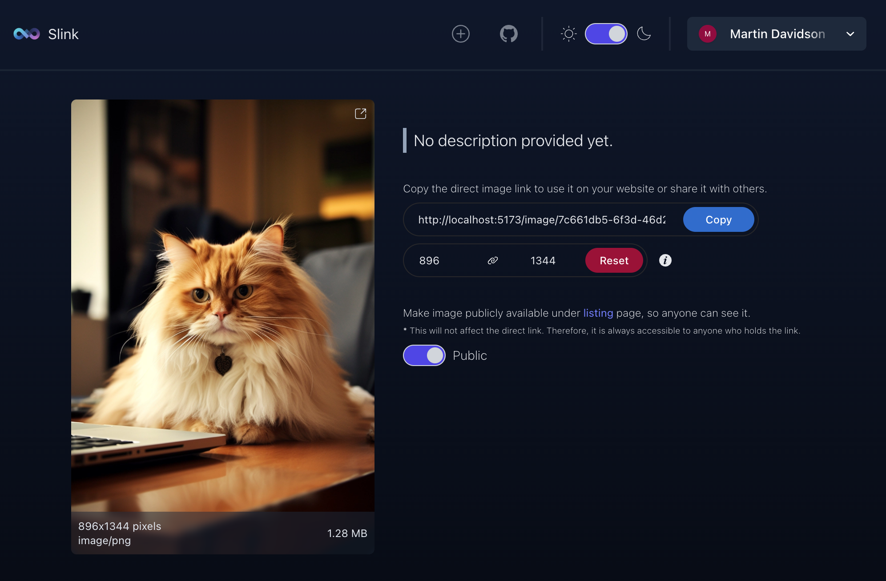

# Slink: Image Sharing Platform


[](LICENSE)


**Slink** is a self-hosted image sharing platform built with [Symfony](https://symfony.com/) and [SvelteKit](https://kit.svelte.dev/) with ❤️.

Solves the problem of sharing images with friends, family, and colleagues without relying on third-party services. It also offers a platform for artists to share their work with the community. Additionally, developers may find it useful for self-hosting screenshots of personal projects, which can then be used on GitHub, portfolios, blogs, etc.

## Features
- **Authentication**: Users can sign up and log in to the platform.
- **User Approval**: Require user approval before they can upload images.
- **Image Upload**: _SVG_, _PNG_, _JPG_, _WEBP_ or _GIF_ images can be uploaded.
- **Share Links**: Users can share links to their uploaded images and customize the image size.
- **Upload History**: Provides an overview of all images uploaded by the user.s
- **Storage Providers**: Support for _local_ and _SMB_ storage providers.
- **Explore Images**: Features a listing page of public images uploaded by other users.
- **Dark Mode**: Includes support for both _Dark_ and _Light_ modes in the application.

### Upcoming Features
**Note:** those might be changed or removed in the future according to the community feedback and priorities.
- **CDN Support**: Support for _CDN_ _providers_ to reduce the load on the self-hosted server.
- **Storage Providers**: Additional storage providers like _AWS S3_, _Google Cloud Storage_, etc.
- **Database Support**: Support for additional databases like _MySQL_, _PostgreSQL_, etc.
- **Admin Panel**: An admin panel to manage users, storage, and other settings.
- **Dashboard**: Enhanced statistics and analytics for admin users.
- **Anonymous Upload**: Allow users to upload images without signing up.
- **Password Recovery**: Password recovery for users who forgot their password.
- **Email Notifications**: Email notifications for user approval, password reset, etc.
- **Public API**: A public API to access the platform programmatically.
- **Security Improvements**: Additional security features like rate limiting, brute force protection, etc.

#### Non-Functional planned improvements
- **Testing**: Comprehensive test coverage for the application.
- **Responsive Design**: A responsive design to support mobile and tablet devices.
- **Theming**: Add more themes and improve the default Light and Dark themes.

## Installation
To install the application, you need to have [Docker](https://docs.docker.com/get-docker/) installed on your system.

Just run the following command to start the application:
```bash
docker run -d \
    --name slink \
    -p 3000:3000 \
    -v ./slink/var/data:/app/var/data \
    -v ./slink/images:/app/slink/images \
    anirdev/slink:latest
```

### Docker Compose

You can also use [Docker Compose](https://docs.docker.com/compose/) to start the application.
```yaml
slink:
    image: anirdev/slink:latest
    container_name: slink
    volumes:
      # Persist the database
      - ./slink/var/data:/app/var/data
      # Persist the uploaded images
      - ./slink/images:/app/slink/images
    ports:
      # Expose the application on port 3000
      - "3000:3000"
```

## Configuration
The application can be configured using environment variables.
Simply set the environment variables when starting the Docker container or in your `docker-compose.yml` when using Docker Compose.

The following environment variables are available:

| Variable | Description                                                      | Default Value |
| -------- |------------------------------------------------------------------|---------------|
| `USER_APPROVAL_REQUIRED` | Whether to require user approval before they can upload images. Available options are `true` and `false` | `true`        |
| `STORAGE_PROVIDER` | Storage provider to use. Available options are `local` and `smb` | `local`       |
| `SMB_HOST` | SMB host to connect to. Required if `STORAGE_PROVIDER` is set to `smb` | `null`        |
| `SMB_USERNAME` | SMB username to use. Required if `STORAGE_PROVIDER` is set to `smb` | `null`        |
| `SMB_PASSWORD` | SMB password to use. Required if `STORAGE_PROVIDER` is set to `smb` | `null`        |
| `SMB_SHARE` | SMB share to use. Required if `STORAGE_PROVIDER` is set to `smb` | `null`        |

## Public Image Listing

The application has an optional image listing page where users can explore images uploaded by other users. 
Only images marked as public will be visible here.

<p align="center">
  
</p>

## Storage Providers
The application supports two storage providers: **local** and **SMB**.
Local storage provider stores the images on the local filesystem, while the SMB storage provider stores the images on a remote SMB server.
By default, the application uses the local storage provider. To persist locally saved images, you need to mount the `/app/slink/images` directory to the host filesystem.

## User Approval
By default, the application requires user approval before they can upload images. You can disable this feature by setting the `USER_APPROVAL_REQUIRED` environment variable to `false`.

If the user approval is enabled, you will have to activate the users manually with CLI command:
```bash
docker exec -it slink slink user:activate --email=<user-email>
```
or 
```bash
docker exec -it slink slink user:activate --uuid=<user-id>
```

Newly registered users will be seeing the following message:

<p align="center">
  
</p>

After the user is approved, they will be able to log in and upload images.

**Note:** Later, an admin panel will be added to manage users and their status.

## Security
Slink supports user authentication and user approval to prevent unauthorized access to the application. However, it's recommended to use a reverse proxy like [Nginx](https://www.nginx.com/) or [Traefik](https://traefik.io/traefik/) 
to add additional security features like SSL, rate limiting, etc.

Be aware that as of now, the application does not have any built-in rate limiting or brute force protection.

**Note:** If you don't want to expose the entire application to the public, you can only expose the `/image` route via the reverse proxy.

## Contributing
Pull requests are welcome. For major changes, please open an issue first to discuss what you would like to change.
Any contributions you make are **greatly appreciated**, whether they are new features, bug fixes, or code quality improvements.

## License

This project is licensed under the MIT License. See the [LICENSE](LICENSE) file for details.
